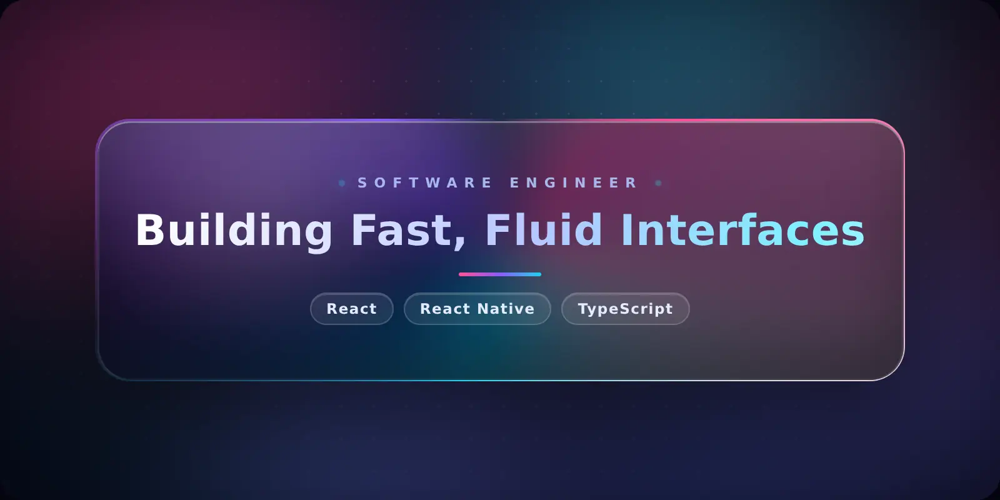

  

<h1 align="center">
  Hi, I'm Prasun Acharjee
  
</h1>

  

  
  
  
  

---

## 👨‍💻 About Me

Frontend-leaning software engineer with **5+ years** shipping React and React Native at scale. I care about the boring-but-important stuff — performance budgets, clean architecture, and interfaces that feel instant on any device. Happiest when I'm untangling a gnarly rendering path or turning a slow page into a fast one.

- 🧩 I turn complex requirements into **maintainable, config-driven UI**
- ⚡ I obsess over **load times, bundle size, and smooth 60fps interactions**
- 🌍 I've built for both **B2B platforms** and **consumer-facing apps**
- 🎓 I enjoy **mentoring** and sharing modern JavaScript patterns

---

## 🛠️ Things I Work On

<table>
  <tr>
    <td width="50%" valign="top">

**🏗️ Frontend Architecture**
- Micro-frontends via Webpack Module Federation
- Backend-for-Frontend (BFF) layers
- Configuration-driven feature systems

    </td>
    <td width="50%" valign="top">

**📱 Cross-Platform Mobile**
- React Native apps, iOS + Android
- Background geolocation & native modules
- Over-the-air (OTA) release pipelines

    </td>
  </tr>
  <tr>
    <td width="50%" valign="top">

**🗺️ Maps & Data Viz**
- Mapbox, Google Maps (Places, Routes), QGIS
- Interactive charts with d3 & p5
- Real-time data dashboards

    </td>
    <td width="50%" valign="top">

**⚙️ Performance & Quality**
- Profiling & cutting redundant API calls
- Test coverage with Jest & RN Testing Library
- CI/CD workflow streamlining

    </td>
  </tr>
</table>

---

## 🧰 Tech Stack

**Languages**

**Frontend**

**Backend & Tooling**

**Cloud & Maps**

---

## 🚀 Featured Projects

### 🐾 [Prowl](https://github.com/Prasun-Acharjee/prowl) — _spot a stray, log it, help it get home_

A community app that turns scattered stray-pet sightings into one shared, map-based record. Snap a photo and a **PostGIS** proximity query surfaces pets already logged nearby — so a repeat sighting adds to a pet's timeline instead of creating a duplicate. In the background, a **Cloudflare Worker** generates **CLIP** image embeddings so pets can be matched visually, and shelters can flag animals as adoptable.

  
  
  
  
  
  
  

### 💬 [Waayou Mobile](https://github.com/Prasun-Acharjee/waayou-mobile) — _a dark-first chat platform in your pocket_

The cross-platform companion to the Waayou chat platform: global rooms, DMs, friends, buzz, and **1:1 / group voice & video** over **WebRTC** — all in a dark-first *"Night Wind"* design language. Shares the web app's session-token auth (stored in the device keychain) and ports the site's real-time mesh-calling stack to native.

  
  
  
  
  
  

---

  <i>⚡ Always up for a good conversation about frontend architecture, performance, or a clever React trick.</i>

